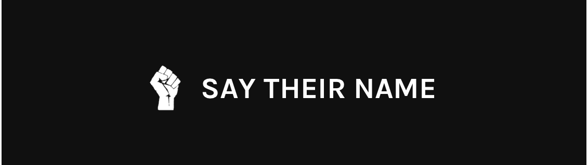

<!--
*** Thanks for checking out this README Template. If you have a suggestion that would
*** make this better, please fork the repo and create a pull request or simply open
*** an issue with the tag "enhancement".
*** Thanks again! Now go create something AMAZING! :D
-->

<!-- PROJECT SHIELDS -->
<!--
*** I'm using markdown "reference style" links for readability.
*** Reference links are enclosed in brackets [ ] instead of parentheses ( ).
*** See the bottom of this document for the declaration of the reference variables
*** for contributors-url, forks-url, etc. This is an optional, concise syntax you may use.
*** https://www.markdownguide.org/basic-syntax/#reference-style-links
-->
[![Contributors][contributors-shield]][contributors-url]
[![Forks][forks-shield]][forks-url]
[![Stargazers][stars-shield]][stars-url]
[![Issues][issues-shield]][issues-url]
[![MIT License][license-shield]][license-url]
[![LinkedIn][linkedin-shield]][linkedin-url]

<!-- PROJECT LOGO -->
 

  

  <h3 align="center">Say Their Names</h3>

  

    
An open source non-profit platform!

    <a href="https://github.com/FranckNdame/say-their-names/issues">Report Bug</a>
    ·
    <a href="https://github.com/FranckNdame/say-their-names/issues">Request Feature</a>
  

<!-- ABOUT THE PROJECT -->
## Current State

We're currently discussing how to approach this project.
Join us on slack!
https://join.slack.com/t/saytheirnames/shared_invite/zt-eqjuatz7-fgh3zPRXIKiiXsC1Vf3oZA

The initial version will be a very simple app. 
The project will then be maintained by volunteers..

Thank you!

### Teams
Each team will be working on a seperate branch.

    <a href="https://github.com/FranckNdame/say-their-names/tree/ios">iOS</a>
    ·
    <a href="https://github.com/FranckNdame/say-their-names/tree/android">Android</a>
  ·
    <a href="https://github.com/FranckNdame/say-their-names/tree/android">Web</a>
  ·
    <a href="https://github.com/FranckNdame/say-their-names/tree/web">Back-end</a>
  ·
    <a href="https://github.com/FranckNdame/say-their-names/tree/web">React Native</a>
  

<!-- GETTING STARTED -->
## Getting Started

Join us on slack!
https://join.slack.com/t/saytheirnames/shared_invite/zt-eqjuatz7-fgh3zPRXIKiiXsC1Vf3oZA

<!-- CONTRIBUTING -->
## Contributing

Contributions are what make the open source community such an amazing place to be learn, inspire, and create. Any contributions you make are **greatly appreciated**.

1. Fork the Project
2. Create your Feature Branch (`git checkout -b feature/AmazingFeature`)
3. Commit your Changes (`git commit -m 'Add some AmazingFeature'`)
4. Push to the Branch (`git push origin feature/AmazingFeature`)
5. Open a Pull Request

<!-- LICENSE -->
## License

Distributed under the MIT License. See `LICENSE` for more information.

<!-- CONTACT -->
## Contact

Franck Ndame - [@breezedoc_in](https://twitter.com/breezedoc_in) - email@example.com

<!-- MARKDOWN LINKS & IMAGES -->
<!-- https://www.markdownguide.org/basic-syntax/#reference-style-links -->
[contributors-shield]: https://img.shields.io/github/contributors/othneildrew/Best-README-Template.svg?style=flat-square
[contributors-url]: https://github.com/othneildrew/Best-README-Template/graphs/contributors
[forks-shield]: https://img.shields.io/github/forks/othneildrew/Best-README-Template.svg?style=flat-square
[forks-url]: https://github.com/othneildrew/Best-README-Template/network/members
[stars-shield]: https://img.shields.io/github/stars/othneildrew/Best-README-Template.svg?style=flat-square
[stars-url]: https://github.com/othneildrew/Best-README-Template/stargazers
[issues-shield]: https://img.shields.io/github/issues/othneildrew/Best-README-Template.svg?style=flat-square
[issues-url]: https://github.com/othneildrew/Best-README-Template/issues
[license-shield]: https://img.shields.io/github/license/othneildrew/Best-README-Template.svg?style=flat-square
[license-url]: https://github.com/othneildrew/Best-README-Template/blob/master/LICENSE.txt
[linkedin-shield]: https://img.shields.io/badge/-LinkedIn-black.svg?style=flat-square&logo=linkedin&colorB=555
[linkedin-url]: https://linkedin.com/in/othneildrew
[product-screenshot]: images/screenshot.png

